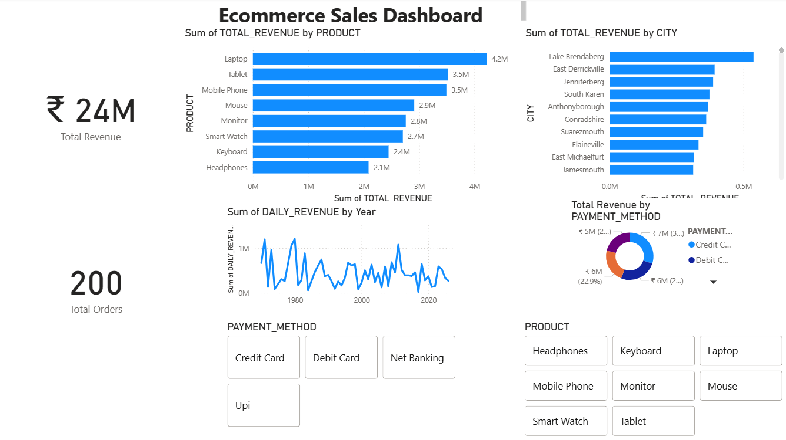

# End-to-End Real-Time Data Engineering Pipeline


---

# Overview

This project demonstrates a modern end-to-end Data Engineering pipeline for processing streaming e-commerce transaction data.

The solution ingests events through Apache Kafka, stores raw data in Amazon S3, transforms the data using the Medallion Architecture in Databricks, loads analytics-ready datasets into Snowflake, orchestrates the workflow using Apache Airflow, and visualizes business insights through Power BI dashboards.

The objective of this project is to demonstrate production-oriented Data Engineering concepts including streaming ingestion, cloud storage, workflow orchestration, scalable transformations, cloud data warehousing, Infrastructure as Code, and business intelligence.

---


---

# Project Objectives

- Build an end-to-end streaming analytics pipeline
- Implement Bronze, Silver and Gold Medallion Architecture
- Process streaming events using Apache Kafka
- Store raw data in Amazon S3
- Transform data using Databricks
- Load curated datasets into Snowflake
- Automate workflows using Apache Airflow
- Visualize business KPIs using Power BI
- Provision infrastructure using Terraform

---

# Technology Stack

| Category | Technology |
|-----------|------------|
| Programming Language | Python |
| Streaming Platform | Apache Kafka |
| Cloud Storage | Amazon S3 |
| Data Processing | Databricks |
| Storage Format | Delta Lake |
| Data Warehouse | Snowflake |
| Workflow Orchestration | Apache Airflow |
| Business Intelligence | Power BI |
| Infrastructure as Code | Terraform |
| Version Control | Git & GitHub |

---


---

# Data Pipeline Workflow

1. Python Producer generates e-commerce transaction events.
2. Apache Kafka streams events through Kafka Topics.
3. Kafka Consumer stores raw JSON events in Amazon S3.
4. Databricks ingests raw data into the Bronze Layer.
5. Data cleansing and validation occur in the Silver Layer.
6. Business metrics are created in the Gold Layer.
7. Curated datasets are loaded into Snowflake.
8. Apache Airflow orchestrates and validates the complete workflow.
9. Power BI connects to Snowflake to visualize business KPIs.

---


### Bronze Layer

- Raw JSON ingestion
- Immutable storage
- Historical data preservation

### Silver Layer

- Data cleansing
- Schema standardization
- Data quality validation

### Gold Layer

- Business KPIs
- Aggregations
- Analytics-ready datasets

---


The Airflow DAG orchestrates the complete pipeline by executing the following tasks:

- Check S3 for new data
- Execute Databricks processing
- Validate Gold Layer output
- Load data into Snowflake
- Validate Snowflake load

---

# Repository Structure

```text
ecommerce-realtime-analytics/

├── architecture/
├── airflow/
├── databricks/
├── docs/
├── jobs/
├── kafka/
│   ├── producer/
│   └── consumer/
├── powerbi/
├── snowflake/
├── terraform/
├── README.md
└── requirements.txt
```

---

# How to Run

### Clone Repository

```bash
git clone https://github.com/prithivnagarajan293-png/ecommerce-realtime-analytics.git

### Start Kafka

```bash
docker compose up
```

### Start Airflow

```bash
docker compose up -d
```

### Run Producer

```bash
python producer.py
```

### Run Consumer

```bash
python consumer.py
```

### Execute Airflow DAG

Trigger the DAG from the Airflow UI.

---

# Dashboard

Power BI connects to Snowflake and visualizes business KPIs such as:

- Total Sales
- Revenue Trends
- Product Performance
- Customer Insights
- Regional Sales


 [Power BI Dashboard](screenshots/powerbi_2.PNG)
 [Power BI Dashboard](screenshots/powerbi_3.PNG)

---

# Production Features Demonstrated

- Event Streaming
- Data Lake Architecture
- Medallion Architecture
- Workflow Orchestration
- Cloud Data Warehouse
- Infrastructure as Code
- Data Validation
- Scalable Data Processing
- Modular Project Structure

---

# Future Improvements

- CI/CD using GitHub Actions
- Unit testing with PyTest
- Data quality monitoring using Great Expectations
- Real-time dashboards
- CDC using Debezium
- Container deployment using Kubernetes
- Monitoring using Prometheus and Grafana

---

# Skills Demonstrated

- Python
- Apache Kafka
- Apache Airflow
- AWS S3
- Databricks
- Delta Lake
- Snowflake
- Power BI
- Terraform
- Git
- End-to-End Data Engineering